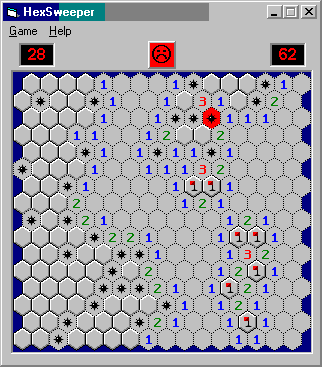



## Minesweeper Hexagonal, updated

### Description

This is a new twist on Minesweeper with its hexagonal tiles. Uses a subrutine recursively to clear out open areas and transperant BitBlt to draw the tiles(fast!). 3 difficulty levels. Straight foward, commented code. Now with custom level & high scores!
 
### More Info
 

             |
---                |---
**Submitted On**   |2003-05-07 20:31:06
**By**             |[Paul Bahlawan](https://github.com/Planet-Source-Code/PSCIndex/blob/master/ByAuthor/paul-bahlawan.md)
**Level**          |Intermediate
**User Rating**    |5.0 (25 globes from 5 users)
**Compatibility**  |VB 6\.0
**Category**       |[Games](https://github.com/Planet-Source-Code/PSCIndex/blob/master/ByCategory/games__1-38.md)
**World**          |[Visual Basic](https://github.com/Planet-Source-Code/PSCIndex/blob/master/ByWorld/visual-basic.md)
**Archive File**   |[Minesweepe1588275152003\.zip](https://github.com/Planet-Source-Code/paul-bahlawan-minesweeper-hexagonal-updated__1-45506/archive/master.zip)

